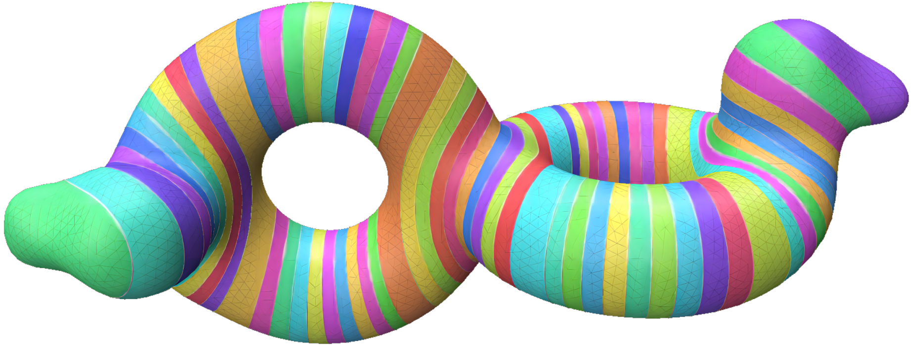

---
## Drafts in English
---
1. A mesh processing code platform: meshDGP
2. Mesh SquareTable Workshop
3. A global Touring Art Exhibition of Computational Discrete Global Geometric Structures
4. The roadmap for the next generation of Industry software
5. Computational Discrete Global Geometric Structures
6. Super Structured Quad Mesh
---
 
[Paper 1](./another-page.html)

 ## 中文文稿
---
1. 网格处理代码平台meshdgp
2. 系列网格方桌会议
3. 可计算离散整体几何结构全国巡回艺术展
4. 中国科协2025年十大工程技术难题之“复杂模型的设计-仿真-制造一体化算法与理论”的解决方案路线图
5. 可计算离散整体几何结构
6. 超结构化四边形网格
---
 

