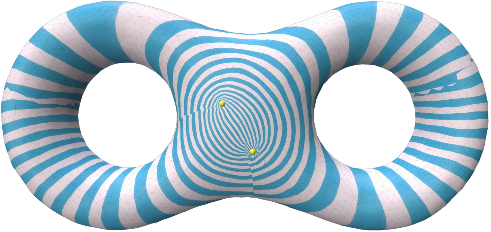
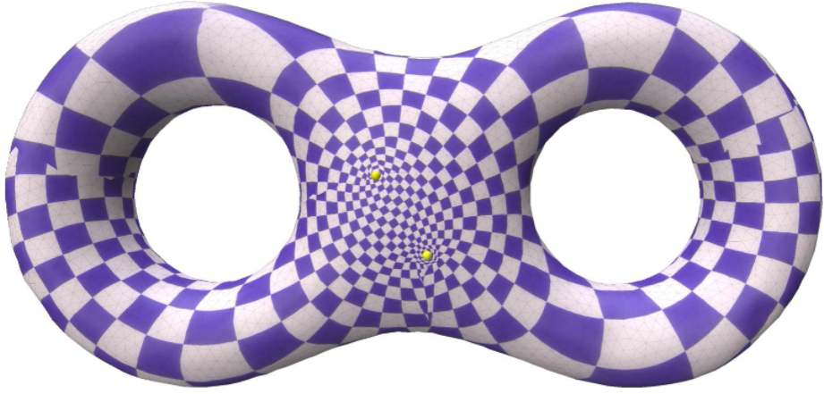
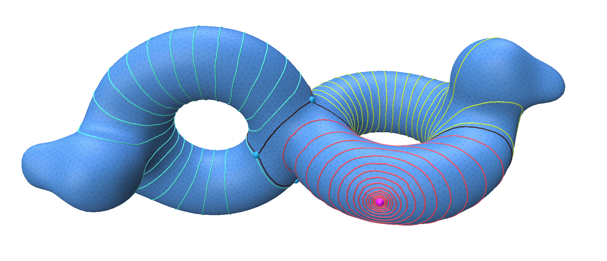
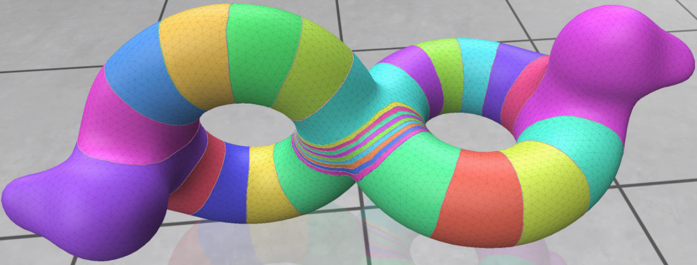
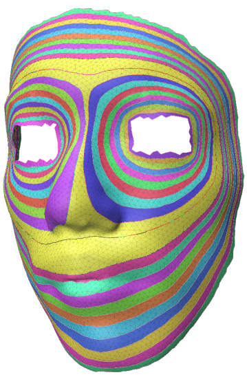
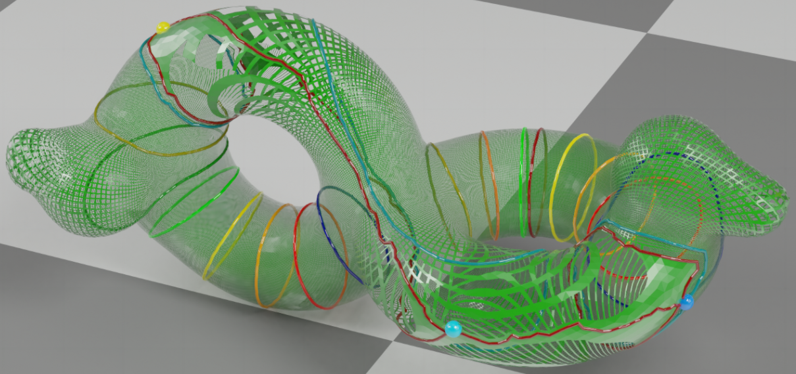
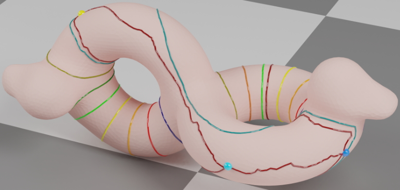

---
### Drafts in English
---
1. [Computational Discrete Global Geometric Structures](./drafts/Computational Discrete Global Geometric Structures.pdf)
2. [A global Touring of Art Exhibition of Computational Discrete Global Geometric Structures](./drafts/A global Touring Art Exhibition of Computational Discrete Global Geometric Structures.pdf)
3. [A mesh processing code platform: meshDGP](./drafts/meshDGP.pdf)
4. [Mesh SquareTable Workshop](./drafts/Mesh SquareTable Workshop.pdf)
5. [The roadmap for the next generation of Industry software](./drafts/The roadmap for the next generation of Industry software.pdf)
6. Super Structured Quad Mesh
7. A Visual Demonstration：Umbilic Torus
8. The Seminar of Differential Geometry Teaching by Code and Visulization
9. [Computational Discrete Global Geometric Structures for Quantum Understanding](./drafts/Quantum_Foliation_HuiZhao.pdf)
10. [Scientist Question: Research on the Impact of Super Structured Quadrilateral Meshes on Convergence and Accuracy of Finite Element Analysis](./drafts/A Scientist Question.pdf)
11. A Geometry and Topology Code Platform: Geometric
    
   [BibTex](./drafts/huizhaoEnglish.txt)
   
---
 

 

---
### 中文文稿

---
1. [可计算离散整体几何结构](./drafts/Computational Discrete Global Geometric Structures.pdf)
2. [可计算离散整体几何结构全国巡回艺术展](./drafts/A global Touring Art Exhibition of Computational Discrete Global Geometric Structures.pdf)
3. [网格处理代码平台meshdgp](./drafts/meshDGP.pdf)
4. [系列网格方桌会议](./drafts/Mesh SquareTable Workshop.pdf)
5. [中国科协2025年十大工程技术难题之“复杂模型的设计-仿真-制造一体化算法与理论”的解决方案路线图](./drafts/The roadmap for the next generation of Industry software.pdf)
6. 超结构化四边形网格
7. 举例说明：Umbilic Torus
8. 微分几何可视化代码教学创新研讨会
9. [量子力学的可计算离散整体几何结构解释](./drafts/Quantum_Foliation_HuiZhao.pdf)
10. [提出一个科学问题：超结构化四边形网格对于有限元计算收敛性和精度的影响](./drafts/A Scientist Question.pdf)
11. 原创几何拓扑代码平台：Geometric
    
    [BibTex](./drafts/huizhaoChinese.txt)
   
---
 
<video 
  src="./pics/eight.mp4"   
  width="100%"  
  controls          
> 
</video>

---
### 可计算离散整体几何结构全国巡回艺术展
### A global Touring of Art Exhibition of Computational Discrete Global Geometric Structures
---

(1)[中原工学院](https://mp.weixin.qq.com/s/mVaDImjek1VJCPbjgfI4bw)

(2)[中科院长春光机所](https://mp.weixin.qq.com/s/AA_ZhkyNIc2nWHq3z9p-_Q)

(3)[华北电力大学](https://mp.weixin.qq.com/s/q4h2WkD9jV79fLYk--sNlQ)

(4)[河南大学](https://mp.weixin.qq.com/s/dooc_h1OxEiNLZMNEjSRVQ)

(5)[西华大学](https://mp.weixin.qq.com/s/G4TtixduxS_IPJg5Zzagzw)

(6)[中国人民大学](https://mp.weixin.qq.com/s/077pHFpz-JUJ-ViBXwym8Q)

(7)[中南民族大学](https://mp.weixin.qq.com/s/eupOQjy87pkB6YZVjAgExw)

(8)[天津城建大学](https://mp.weixin.qq.com/s/8XSdyecEtaaPRW6XbyJ2fA)

(9)[太原理工大学](https://mp.weixin.qq.com/s/f_Ii5_ucM16i1CYOgFrCrA)

(10)[中国科学院合肥物质科学研究院强磁场科学中心](https://mp.weixin.qq.com/s/Shlo_pytclL6M2F3jrlM1w)

(11)[江西理工大学](https://mp.weixin.qq.com/s/XoP9HyH8W98tm_YOdYshSg)

(12)[大理李政道科学艺术中心](https://mp.weixin.qq.com/s/wM0P6jsoCdhWNO6vbYavXg)

---
 

---

### 系列网格方桌会议
### Mesh SquareTable Workshop
---

1.[第一届  网格方桌会议](https://mp.weixin.qq.com/s/ClhQ8SLAB42c7zjOWbid-A)：代码编程层面

[天津城建大学理学院承办](https://mp.weixin.qq.com/s/i8Zq90zxmJhR5XC1j_Amgg)

开幕词：[贾国治院长](https://mp.weixin.qq.com/s/DMFxdFFemaiunDereBfdBA)  

主办人：张东老师 

---
2.[第二届 网格方桌会议](https://mp.weixin.qq.com/s/sWfZ5rjQ_EvK-GZqkDG_lw)：CADCAE小软件大开发层面  

[安徽师范大学物理与电子信息学院承办](https://mp.weixin.qq.com/s/NTBb476DvDD9OVkzEzwdxg)

开幕词：[张爱清院长](https://mp.weixin.qq.com/s/DfKIfqhJIUGlL7p0ESqxPQ) 

主办人：[陈鹏老师](https://mp.weixin.qq.com/s/YUkcWalfpUCOcn7ed41r5w)

---
3.[第三届 网格方桌会议](https://mp.weixin.qq.com/s/mml0HuEAVL3xeE-v560VZA)：可视化渲染层面  

[江西理工大学理学院承办](https://mp.weixin.qq.com/s/VvLKIYGgZUFTrzfnxub3ng)

开幕词：  [徐中辉院长](https://mp.weixin.qq.com/s/3w9Y80quJfSCSPrh8PT2Cg)

主办人： 杨火根老师

---

4.[第四届 网格方桌会议](https://mp.weixin.qq.com/s/djBFMJCAmVaUO8K7X2Id9g)：面向代码的微分几何可视化学习和教学

[河南大学数学与统计学院承办](https://mp.weixin.qq.com/s/DILNN6w-8k8sgy-RGv3bqQ)

开幕词：[唐恒才院长](https://mp.weixin.qq.com/s/c-_B7rnIMVNWo4fVwYPC8g)

主办人：[韩喆老师](https://maths.henu.edu.cn/info/1052/15730.htm)

---
5.[第五届 网格方桌会议](https://mp.weixin.qq.com/s/zoYaDvxi01-lqjtAcoaN3A)：优化问题、线性系统、求解器  

[北京工业大学数学统计与力学学院承办](https://mp.weixin.qq.com/s/jjaAO18Bl2KU8kxzyQcFpg)

开幕词：黄秋梅院长  

主办人：诸葛昌靖老师

---
6.[第六届 网格方桌会议](https://mp.weixin.qq.com/s/15bxBUkyk_4cXBi-BUt4Lw)： 计算机图形学+其他学科交叉融合     

[中原工学院数学与信息科学学院承办](https://mp.weixin.qq.com/s/J3DkkFaO5JRtln-eEGMfWA)

开幕词：闫振亚院长   

主办人：周瑞芳老师

---
7.[第七届网格方桌会议](https://mp.weixin.qq.com/s/xX3EGG4gR01ty3pIi340dg)：网格+可计算整体几何结构方面论文写作风格评析  

[常州工学院理学院院长承办](https://mp.weixin.qq.com/s/Ax6ohqSwOJC5Q_jGxumRPA)

开幕词：[陈荣军院长](https://lxy.czu.cn/2025/0605/c7604a159956/page.htm)

主办人：刘永财老师

---
8.[第八届网格方桌会议](https://mp.weixin.qq.com/s/ocFCx8yBUG3OTYzqtqNMUQ)：网格+整体几何结构+艺术  

[中国科学院合肥物质科学研究院强磁场科学中心承办](https://mp.weixin.qq.com/s/baEmmlYqLpqZPFLdoVaNDw)

开幕词：[杜海峰主任](http://www.hmfl.cas.cn/nxwzx/zhxw/202507/t20250715_620308.html)

主办人：杜海峰主任

---

---

HuiZhao   

graphicsresearch@qq.com
---

### 微信订阅号：[可计算离散整体几何结构二维码](https://mp.weixin.qq.com/s/bydA_SMV-Hu1VHYOhrvsGA)
---

 
 

